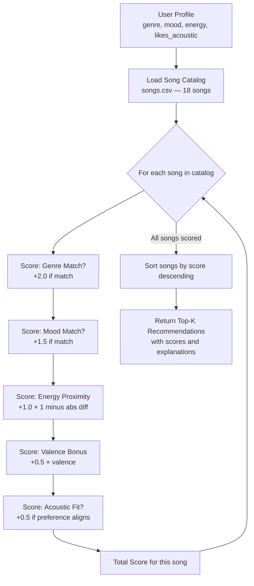

# 🎵 Music Recommender Simulation

## Project Summary

In this project you will build and explain a small music recommender system.

Your goal is to:

- Represent songs and a user "taste profile" as data
- Design a scoring rule that turns that data into recommendations
- Evaluate what your system gets right and wrong
- Reflect on how this mirrors real world AI recommenders

This project simulates a content-based music recommender. It scores a catalog of 18 songs against a user's taste profile using weighted feature matching (genre, mood, energy, valence, acousticness) and returns the top-k recommendations with explanations for each pick.

---

## How The System Works

### How Real-World Recommendations Work

Major streaming platforms like Spotify use two core approaches to predict what users will love next:

- **Collaborative filtering** relies on the behavior of many users; likes, skips, playlist additions, listening duration, and session context (time of day, device). It finds "users like you" and recommends what similar listeners enjoyed. The key insight is that you never need to analyze the music itself; patterns in collective behavior are enough.
- **Content-based filtering** relies on song attributes; genre, tempo, energy, mood, valence, danceability, acousticness. It builds a profile of what a user likes and finds songs with similar characteristics. The key insight is that songs sharing musical DNA tend to appeal to the same person.

Spotify combines both approaches (a hybrid system) and layers on reinforcement learning to optimize for long-term satisfaction, not just immediate clicks. The main data types flowing through these systems include: **user signals** (likes, skips, saves, playlist adds, listening time) and **audio features** (tempo, energy, valence, danceability, acousticness, key, loudness).

### What Our Version Prioritizes

Our simulator implements a **content-based filtering** approach. Since we have no multi-user behavior data, we focus entirely on matching song attributes to a single user's taste profile. The scoring system uses a proximity-based rule: for numerical features like energy, a song is scored higher the *closer* it is to the user's target value (using `1 - |preference - value|`), rather than simply rewarding higher or lower values. Categorical features (genre, mood) use exact-match bonuses with configurable weights.

We need two distinct rules to make this work:
1. **Scoring Rule** (per song): Evaluates one song against the user profile and produces a numeric score with an explanation.
2. **Ranking Rule** (for the catalog): Sorts all scored songs in descending order and returns the top-k results as the final recommendation list.

### Algorithm Recipe

The scoring function computes a total score for each song as follows:

| Feature         | Rule                                           | Weight |
|-----------------|------------------------------------------------|--------|
| **Genre**       | +2.0 if song genre == user's favorite genre    | 2.0    |
| **Mood**        | +1.5 if song mood == user's favorite mood      | 1.5    |
| **Energy**      | `1.0 × (1 - |target_energy - song.energy|)`    | 1.0    |
| **Valence**     | `0.5 × song.valence` (mild bonus for positive) | 0.5    |
| **Acousticness**| +0.5 if `likes_acoustic` and acousticness > 0.6, or if `!likes_acoustic` and acousticness < 0.4 | 0.5 |

**Total score** = genre_points + mood_points + energy_proximity + valence_bonus + acoustic_bonus

Genre matching is weighted most heavily (2.0) because it defines the broadest musical category. Mood is next (1.5) because two songs in the same genre can feel completely different. Energy proximity (1.0) fine-tunes intensity. Valence and acousticness are lighter signals (0.5 each) that nudge the ranking without dominating it.

**Ranking Rule**: After scoring every song, sort descending by total score. Return the top-k songs along with their scores and a human-readable explanation of why each was picked.

### Data Flow Diagram



### Sample User Profiles

To verify the system can differentiate between different tastes, we define three test profiles:

- **Intense Rock Fan**: `{genre: "rock", mood: "intense", energy: 0.9, likes_acoustic: False}` — should rank "Storm Runner" and "Shattered Glass" highest
- **Chill Lofi Studier**: `{genre: "lofi", mood: "chill", energy: 0.35, likes_acoustic: True}` — should rank "Library Rain" and "Midnight Coding" highest
- **Upbeat Pop Listener**: `{genre: "pop", mood: "happy", energy: 0.8, likes_acoustic: False}` — should rank "Sunrise City" and "Gym Hero" highest

### Potential Biases

- **Genre over-prioritization**: At weight 2.0, genre dominates the score. A song that perfectly matches mood, energy, and acousticness but is in the wrong genre will score lower than a genre-match with poor fit elsewhere. This mirrors a real filter bubble problem.
- **Categorical rigidity**: An "indie pop" song won't match a "pop" preference despite being closely related. The system has no concept of genre similarity.
- **Small catalog bias**: With only 18 songs, some genres have a single representative. The system can't distinguish between liking "hip-hop" as a genre and liking the one hip-hop song's specific attributes.
- **No temporal or contextual awareness**: The system ignores time of day, recent listening history, or sequential flow — all things real recommenders account for.

### Features Used

**`Song` attributes** (from `songs.csv` — 18-song catalog):
- `genre` — categorical (pop, lofi, rock, ambient, jazz, synthwave, indie pop, electronic, r&b, country, metal, classical, hip-hop, reggae)
- `mood` — categorical (happy, chill, intense, relaxed, moody, focused, energetic, romantic, aggressive, peaceful, melancholic)
- `energy` — float [0–1], intensity/excitement level
- `valence` — float [0–1], musical positivity
- `danceability` — float [0–1], rhythmic suitability for dancing
- `acousticness` — float [0–1], acoustic vs. electronic character
- `tempo_bpm` — integer, beats per minute

**`UserProfile` attributes**:
- `favorite_genre` — preferred genre (exact-match scoring)
- `favorite_mood` — preferred mood (exact-match scoring)
- `target_energy` — preferred energy level (proximity scoring)
- `likes_acoustic` — boolean preference for acoustic sound (bonus/penalty on acousticness)

### Terminal Output

<a href="terminal-output.png" target="_blank"></a>

---

## Getting Started

### Setup

1. Create a virtual environment (optional but recommended):

   ```bash
   python -m venv .venv
   source .venv/bin/activate      # Mac or Linux
   .venv\Scripts\activate         # Windows

2. Install dependencies

```bash
pip install -r requirements.txt
```

3. Run the app:

```bash
python -m src.main
```

### Running Tests

Run the starter tests with:

```bash
pytest
```

You can add more tests in `tests/test_recommender.py`.

---

## Experiments You Tried

Use this section to document the experiments you ran. For example:

- What happened when you changed the weight on genre from 2.0 to 0.5
- What happened when you added tempo or valence to the score
- How did your system behave for different types of users

---

## Limitations and Risks

Summarize some limitations of your recommender.

Examples:

- It only works on a tiny catalog
- It does not understand lyrics or language
- It might over favor one genre or mood

You will go deeper on this in your model card.

---

## Reflection

Read and complete `model_card.md`:

[**Model Card**](model_card.md)

Write 1 to 2 paragraphs here about what you learned:

- about how recommenders turn data into predictions
- about where bias or unfairness could show up in systems like this


---

## 7. `model_card_template.md`

Combines reflection and model card framing from the Module 3 guidance. :contentReference[oaicite:2]{index=2}  

```markdown
# 🎧 Model Card - Music Recommender Simulation

## 1. Model Name

Give your recommender a name, for example:

> VibeFinder 1.0

---

## 2. Intended Use

- What is this system trying to do
- Who is it for

Example:

> This model suggests 3 to 5 songs from a small catalog based on a user's preferred genre, mood, and energy level. It is for classroom exploration only, not for real users.

---

## 3. How It Works (Short Explanation)

Describe your scoring logic in plain language.

- What features of each song does it consider
- What information about the user does it use
- How does it turn those into a number

Try to avoid code in this section, treat it like an explanation to a non programmer.

---

## 4. Data

Describe your dataset.

- How many songs are in `data/songs.csv`
- Did you add or remove any songs
- What kinds of genres or moods are represented
- Whose taste does this data mostly reflect

---

## 5. Strengths

Where does your recommender work well

You can think about:
- Situations where the top results "felt right"
- Particular user profiles it served well
- Simplicity or transparency benefits

---

## 6. Limitations and Bias

Where does your recommender struggle

Some prompts:
- Does it ignore some genres or moods
- Does it treat all users as if they have the same taste shape
- Is it biased toward high energy or one genre by default
- How could this be unfair if used in a real product

---

## 7. Evaluation

How did you check your system

Examples:
- You tried multiple user profiles and wrote down whether the results matched your expectations
- You compared your simulation to what a real app like Spotify or YouTube tends to recommend
- You wrote tests for your scoring logic

You do not need a numeric metric, but if you used one, explain what it measures.

---

## 8. Future Work

If you had more time, how would you improve this recommender

Examples:

- Add support for multiple users and "group vibe" recommendations
- Balance diversity of songs instead of always picking the closest match
- Use more features, like tempo ranges or lyric themes

---

## 9. Personal Reflection

A few sentences about what you learned:

- What surprised you about how your system behaved
- How did building this change how you think about real music recommenders
- Where do you think human judgment still matters, even if the model seems "smart"

